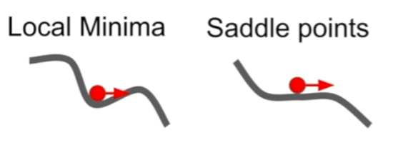

## 训练神经网络

### 超参数相关

参数：**自动的**，是可以通过训练和学习优化的；

超参数 hyperparameters：**手动设置的**，比如学习率，隐藏层的数量，核函数的大小数量等等，是不能通过训练进行优化的。

一般我们都是通过观察在训练过程中的监测指标如损失函数的值或者测试/验证集上的准确率来判断这个模型的训练状态，并通过修改超参数来提高模型效率。下面列出了几个深度学习超参的例子：

- 优化器（Optimizer）：机器学习算法的参数都需要优化器来优化，比较传统的是随机梯度下降（SGD），但是它收敛较慢而且在某些情况下比较容易得到局部最优解。Adam是目前收敛速度快且常被使用的优化器，它加入了动量Momentum，可以加速收敛并且有更好的最优解。
- 迭代次数：迭代次数是指训练网络时候同时完成前向/反向传播的次数。每次迭代都会更新网络模型的参数并且减小损失函数的值。比较合适的迭代次数为测试/训练错误错误率相差较小并且两者错误率都在能接受范围内的时候。如果此时继续训练网络，很有可能会出过拟合的情况。
- 激活函数：在神经网络中，激活函数的作用是增加非线性因素，以至于网络可以拟合复杂的非线性函数来更高效地解决复杂的问题。因为在实际情况中，更多问题都是非线性的，所以运用非线性激活函数可以拟合实际场景问题，增加网络的泛化能力。常用的激活函数有sigmoid, relu, tanh, leaky relu等等。
- 学习率（Learning rate）是指在优化算法中更新网络权重的幅度大小。学习率可以是恒定的、逐渐降低的，基于动量的或者是自适应的。不同的优化算法决定不同的学习率。当学习率过大则可能导致模型不收敛，损失loss不断上下震荡；学习率过小则导致模型收敛速度偏慢，需要更长的时间训练。通常学习率取值为[0.01, 0.001, 0.0001]。
- 超参的例子还有很多，他们都对网络的性能起着很大的作用，当然其中一些超参比其他参数重要我们可以以下图为参考标准来划分优先级，如学习率一般是最重要的。

1. 超参数优化的方法：
   
   随机搜索，网格搜索、**贝叶斯优化**等等

### Problems with SGD（stochastic gradient descent）

1. 对于SGD，每次梯度更新的方向只跟当前的梯度有关，因此会呈现锯齿状前进。


对于SGD，容易陷入局部最小值local minima or saddle point 鞍点，因为局部最小值当前梯度为0



对于SGD，如果梯度有噪声，会让损失函数蜿蜒.

### 添加动量，SGD+Momentum

本质上是利用Velocity和Gradient进行一个加权


SGD:

$$
x_{t+1} = x_t - \alpha \Delta f(x_t)
$$

```python
while True:
    dx = compute_gradient(x)
    x += learning_rate*dx
```

SGD+Momentun: （rho是作用力？摩擦？一般设置为0.99或者0.9）

$$
v_{t+1}=\rho v_t +\Delta f(x_t)\\
x_{t+1}=x_t-\alpha v_{t+1}
$$

```python
vx=0 ##vx是所有梯度的累计，有点类似于惯性
while True:
    dx = compute_gradient(x)
    vx = rho * vx +dx
    x += learning_rate * vx
```

### Nesterov Momentum

在Nesterov Momentum中，先沿着之前积累的梯度走一步，然后再计算这一步的终点的梯度，利用该梯度进行校正，得到最终的更新方向。相当于在Nesterov中添加了一个校正因子，Nesterov Momentum的位置更新取决于**之前积累的梯度和根据之前积累梯度走到的位置的梯度**


$$
v_{t+1} = \rho v_t - \alpha \Delta f(x_t+\rho v_t) \\
x_{t+1} = x_t+ v_{t+1}
$$

**说白了就是，普通动量是先根据以往的速度和当前 的梯度，得到走一步的方向（画一下矢量三角）；而 牛顿动量，是要沿着之前累计的梯度走一步（假走），再计算假终点的梯度，然后用这个梯度来校正速度方向，画画图就明白了**

与Momentum唯一区别就是，计算梯度的不同，Nesterov先用当前的速度v更新一遍参数，在用更新的临时参数计算梯度。

$$
令 x_t'=x_t+\rho v_t\\
则\\
 v_{t+1} = \rho v_t - \alpha \Delta f(x_t')\\
 x_{t+1}'=x_t'-\rho v_t +(1+\rho )v_{t+1}=x_t'+v_{t+1}+\rho (v_{t+1}-v_t) \\

 改了参数之后可以这么理解：用梯度去修正当前速度，然后x_t加上当前速度\\
 然后加上当前速度和先前速度的某种纠错项
$$

```python
dx = compute_gradient(x)
old_v = v
v = rho * v - learning_rate * dx
x+= -rho * old_v + (1+rho)*v ## x+= v + rho(v-old_v)
```

### AdaGrad

随着梯度的累计，缩小学习率

```python
grad_squared=0
while True:
    dx = compute_gradient(x)
    grad_squared += dx *dx
    x-= learning_rate * dx /(np.sqrt(grad_squared)+1e-7)
```

### RMSProp

可以这么理解，沿着一个维度缓慢减速运动，和沿着一个维度缓慢加速运动，比AdaGrad多了后面这一个好处。

这个图中有一小段绿色，就是AdaGrad，由于学习率不断衰减被卡住了。

```python
grad_squared=0
while True:
    dx = compute_gradient(x)
    grad_squared += decay_rate * grad_squared + (1-decay_rate) * dx *dx
    x-= learning_rate * dx /(np.sqrt(grad_squared)+1e-7)
```

### Adam（almost）

**有一点点像RMSProp，只不过最后的dx换成了first_moment,不仅仅考虑dx梯度，还考虑了动量**

```python
first_moment = 0
second_moment = 0
while True:
    dx = compute_gradient(x)
    first_moment = beta1 * first_moment +(1-beta1)*dx
    second_moment = beta2 * second_moment +(1-beta2)*dx *dx
    x -= learning_rate * first_moment /(np.sqrt(second_moment)+1e-7)
```

### Adam (完整形态)

将first_moment和second_moment都除以一个(1-beta ** t) ，t是迭代次数，经过偏置校正后的第一矩估计向量和第二矩估计向量


二阶矩可以理解成 转动惯量


$$
\frac{1}{2} Jw^2
$$

还可以想象为，离当前位置越远的点，乘的衰减次数也就越多（影响越小）

比如第一次迭代t=1，first_moment = (1-beta1)*dx，但是这样是有偏的，需要矫正除以一个(1-beta1),随着t的增加就开始不校正了。

怎么得到的 (1-beta^t) ？求和一下first_moment就知道了，但是最后要近似 gi=gt这个是我很难理解的。

```python
first_moment = 0
second_moment = 0
for t in range(num_iterations):
    dx = compute_gradient(x)
    first_moment = beta1 * first_moment +(1-beta1)*dx
    second_moment = beta2 * second_moment +(1-beta2)*dx *dx
    first_unbias = first_moment /(1-beta1 ** t)
    second_unbias = second_moment /(1-beta2 ** t)
    x -= learning_rate * first_unbias / (np.sqrt(second_unbias)+1e-7)
```

### 二阶优化器

诸如L-BFGS

### DropOUT

